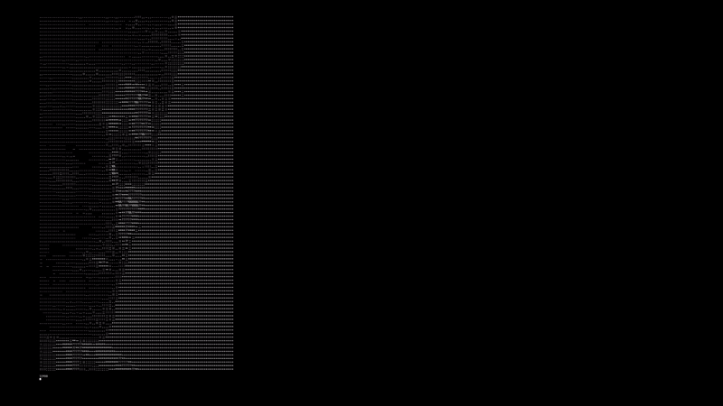

# Ascii Video Player

Ascii video player built using opencv

The main idea of this project is to have a way to view content through terminal.
Potentially acting as the backend of a neovim plugin

## Demo

## TODO

- [ ] Migrate to Go and create executable?
- [ ] Parse and display youtube video
